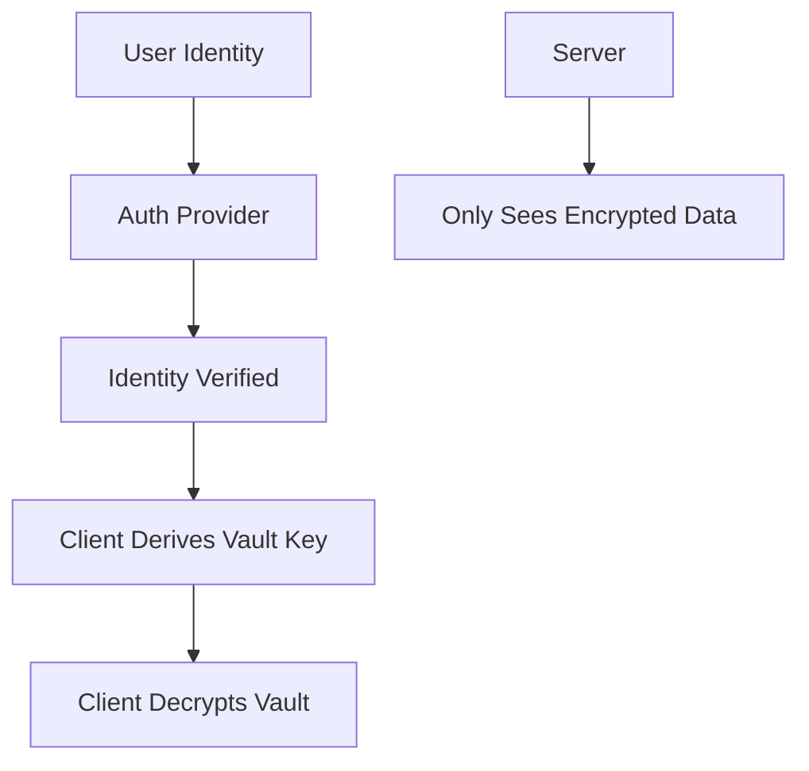

# Authentication Architecture & Roadmap

## 🏗️ **Pluggable Authentication System**

Coldforge Vault uses a **pluggable authentication architecture** that allows easy addition of new identity providers while maintaining zero-knowledge security.

## 🔑 **Current Authentication Methods**

### ✅ **Email/Password** (Production Ready)
- **Features:** Traditional username/password with secure hashing
- **Security:** Scrypt key derivation + SHA-256
- **MFA Support:** TOTP, SMS, Hardware keys
- **Recovery:** Email-based password reset + recovery codes

### ✅ **Nostr** (Production Ready)
- **Features:** Cryptographic key-based authentication
- **Security:** secp256k1 signatures with challenge/response
- **No MFA Needed:** Cryptographic signatures are inherently strong
- **Recovery:** Private key backup + trusted device recovery

## 🚀 **Planned Authentication Methods**

### 🎯 **WebAuthn/FIDO2** (High Priority)
```go
type WebAuthnProvider struct {
    // Hardware security keys (YubiKey, etc.)
    // Biometric authentication (TouchID, FaceID, Windows Hello)
    // Platform authenticators
}

// Required fields: ["credential_id", "authenticator_data", "signature"]
// Features: Phishing-resistant, hardware-backed, passwordless
```

### 🎯 **OAuth2/OIDC Providers** (Medium Priority)
```go
type OAuthProvider struct {
    // Google, GitHub, Microsoft, Apple
    // Enterprise SSO (SAML, LDAP integration)
    // Social login providers
}

// Required fields: ["provider", "code", "redirect_uri"]
// Features: Federated identity, enterprise integration
```

### 🔮 **Future Identity Methods** (Research Phase)

**🌐 Blockchain Identity:**
```go
type BlockchainProvider struct {
    // Ethereum wallet signatures (MetaMask, WalletConnect)
    // Solana wallet authentication
    // Bitcoin message signing
    // ENS domain verification
}
// Use case: Web3 native users, DeFi integration
```

**🤖 AI-Powered Behavioral Auth:**
```go
type BehavioralProvider struct {
    // Typing patterns, mouse movements
    // Device fingerprinting
    // Risk-based authentication
}
// Use case: Continuous authentication, fraud detection
```

**📱 Mobile Carrier Auth:**
```go
type CarrierProvider struct {
    // SIM-based authentication
    // Network operator verification
    // SMS-less mobile auth
}
// Use case: Mobile-first markets, SIM security
```

**🏢 Enterprise Directory:**
```go
type EnterpriseProvider struct {
    // Active Directory integration
    // LDAP authentication
    // SAML federation
    // Kerberos tickets
}
// Use case: Corporate deployment, compliance
```

## 🔐 **Zero-Knowledge Architecture Maintained**

**Every auth method preserves zero-knowledge:**

1. **Identity Verification** ≠ **Data Decryption**
2. **Master Key Derivation** happens client-side
3. **Server only stores encrypted vaults**
4. **Authentication providers never see vault contents**



## 🛡️ **Multi-Factor Authentication Matrix**

| Primary Auth | Compatible MFA | Security Level |
|--------------|----------------|----------------|
| Email/Password | TOTP, SMS, Hardware Key | ⭐⭐⭐ |
| Nostr | Hardware Key (optional) | ⭐⭐⭐⭐⭐ |
| WebAuthn | Backup authenticator | ⭐⭐⭐⭐⭐ |
| OAuth2 | Provider's MFA | ⭐⭐⭐ |
| Blockchain | Hardware wallet | ⭐⭐⭐⭐ |

## 🎯 **Implementation Priority**

### **Phase 1: Core Auth (Current)**
- ✅ Email/Password provider
- ✅ Nostr provider  
- ✅ Pluggable architecture
- 🔄 Complete database integration

### **Phase 2: Modern Auth (Next 3 months)**
- 🎯 **WebAuthn/FIDO2** - Hardware keys, biometrics
- 🎯 **Complete Nostr flow** - Full challenge/response
- 🎯 **MFA Integration** - TOTP, backup codes
- 🎯 **Recovery system** - Multiple recovery options

### **Phase 3: Advanced Auth (6+ months)**
- 🔮 **OAuth2 providers** - Google, GitHub, Apple
- 🔮 **Enterprise integration** - SAML, LDAP
- 🔮 **Risk-based auth** - Behavioral analysis
- 🔮 **Blockchain providers** - Web3 integration

## 💡 **Architecture Benefits**

### **For Users:**
- **Choice of identity** - Use preferred authentication method
- **Progressive enhancement** - Start simple, add security layers
- **Future-proof** - New auth methods added seamlessly
- **Zero vendor lock-in** - Multiple identity options

### **For Developers:**
- **Clean interfaces** - Easy to add new providers
- **Testable components** - Each provider isolated
- **Maintainable code** - Separation of concerns
- **Compliance ready** - Enterprise auth requirements

### **For Security:**
- **Defense in depth** - Multiple auth factors
- **Risk adaptation** - Auth strength based on risk
- **Zero-knowledge preserved** - Identity ≠ encryption key
- **Audit trails** - Complete authentication logging

## 🧪 **Testing Strategy**

Each authentication provider includes:
- **Unit tests** - Provider logic isolation
- **Integration tests** - Database interaction
- **Security tests** - Cryptographic validation
- **Performance tests** - Auth latency measurement
- **Compatibility tests** - Cross-platform validation

## 🚀 **Recommended Next Steps**

1. **Complete Nostr integration** - Full production flow
2. **Add WebAuthn support** - Modern passwordless auth
3. **Implement MFA system** - TOTP + backup codes
4. **Build recovery system** - Multiple recovery paths
5. **Add provider testing** - Comprehensive test coverage

This architecture ensures Coldforge Vault can **evolve with identity trends** while maintaining **zero-knowledge security** and **user choice**! 🔐✨