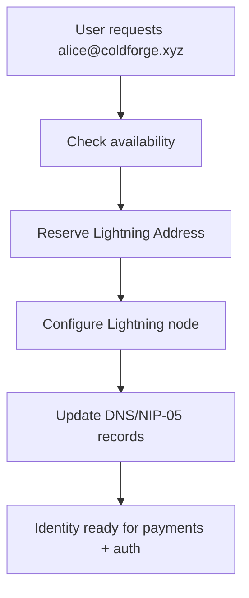

# Lightning Address Integration - @coldforge.xyz Universal Bitcoin Identity

## 🎯 **Vision: One Address for Everything**

**alice@coldforge.xyz** becomes a universal Bitcoin identity that handles:
- ⚡ **Lightning payments** - Receive Bitcoin instantly
- 🔑 **Authentication** - Passwordless login to Coldforge Vault
- 🆔 **Nostr identity** - NIP-05 verification for social networks
- 📧 **Communication** - Encrypted messaging (future)

## 🏗️ **Technical Architecture**

### **Domain Infrastructure:**
```
coldforge.xyz/
├── .well-known/
│   ├── lnurlp/           # Lightning Address endpoints
│   ├── nostr.json        # NIP-05 verification
│   └── lnurlauth/        # LNURL-auth endpoints
├── api/v1/
│   ├── lightning/        # Lightning node integration
│   ├── identity/         # Identity management
│   └── auth/             # Authentication endpoints
└── app/                  # Coldforge Vault web interface
```

### **Lightning Address Flow:**


## 🔧 **Implementation Plan**

### **Phase 1: Domain & Lightning Infrastructure**
```bash
# 1. Domain setup
• Register coldforge.xyz domain
• Configure DNS with Lightning Address support
• Set up SSL certificates
• Create subdomain structure

# 2. Lightning node integration
• Connect to Lightning node (LND/CLN)
• Configure payment endpoints
• Set up LNURL-pay responses
• Test Lightning Address payments
```

### **Phase 2: Identity Service**
```go
// Lightning Address identity service
type IdentityService struct {
    lightningNode LightningClient
    domain        string
    database      *sql.DB
}

func (s *IdentityService) RegisterIdentity(username string, nostrPubkey string, userID uuid.UUID) (*Identity, error) {
    // 1. Validate username availability
    // 2. Reserve Lightning Address
    // 3. Configure Lightning node endpoint
    // 4. Update NIP-05 records
    // 5. Return unified identity
}
```

### **Phase 3: Authentication Integration**
```typescript
// Frontend Lightning Address auth
const authenticateWithLightning = async (lightningAddress: string) => {
  // 1. Parse alice@coldforge.xyz
  // 2. Generate LNURL-auth request
  // 3. User signs with Lightning wallet
  // 4. Verify signature with Lightning node
  // 5. Auto-login with Lightning identity
}
```

## 🔑 **Authentication Flows**

### **Existing Users (Email):**
1. Login with email/password
2. Go to Settings → Lightning Identity
3. Request: **yourname@coldforge.xyz**
4. Future logins: Use Lightning Address OR email

### **Nostr Users:**
1. Connect Nostr extension
2. Auto-login with Nostr signature
3. Auto-assigned: **npub123@coldforge.xyz**
4. Future: Use Nostr OR Lightning Address

### **Lightning Users (New!):**
1. Enter: **alice@coldforge.xyz**
2. LNURL-auth challenge generated
3. Sign with Lightning wallet
4. Auto-login + auto-create account
5. Lightning Address becomes universal identity

## ⚡ **Lightning Address Features**

### **Payment Integration:**
```
alice@coldforge.xyz can receive:
• Lightning payments (instant Bitcoin)
• Tips for content creation
• Subscription payments
• Micropayments for services
```

### **Authentication Integration:**
```
alice@coldforge.xyz can authenticate to:
• Coldforge Vault (password manager)
• Bitcoin services supporting LNURL-auth
• Future: Any service in Lightning ecosystem
```

### **Social Integration (NIP-05):**
```
alice@coldforge.xyz provides:
• Verified Nostr identity
• Cross-platform username
• Trusted social handle
• Decentralized verification
```

## 🚀 **Business Model Integration**

### **Identity Service Revenue:**
- **Premium addresses**: $10/year for custom @coldforge.xyz
- **Vanity addresses**: $100/year for short names
- **Enterprise addresses**: Custom pricing for companies
- **Payment routing**: Small fee on Lightning payments

### **Value Proposition:**
- **For users**: Universal Bitcoin identity + secure password management
- **For ecosystem**: Trusted identity verification service
- **For developers**: Easy Lightning Address integration
- **For enterprises**: Professional identity management

## 📋 **Implementation Priority**

### **Week 1-2: Foundation**
```bash
✅ Nostr authentication working
🔄 Set up coldforge.xyz domain
🔄 Configure Lightning node
🔄 Basic Lightning Address resolution
```

### **Week 3-4: Integration**
```bash
🔄 LNURL-auth implementation
🔄 NIP-05 verification service
🔄 Frontend Lightning auth
🔄 Identity management interface
```

### **Week 5-6: Polish**
```bash
🔄 Payment integration
🔄 Advanced identity features
🔄 Enterprise management tools
🔄 Documentation and onboarding
```

## 🎯 **Success Metrics**

### **Technical:**
- Lightning Address resolution: <200ms
- Authentication success rate: >99%
- Payment success rate: >99.5%
- Identity verification: <1 second

### **Adoption:**
- First 100 @coldforge.xyz addresses reserved
- Bitcoin Twitter influencers using the service
- Developer ecosystem building on the platform
- Enterprise customers requesting addresses

## 🌟 **Revolutionary Impact**

**This creates the first truly unified Bitcoin identity service:**
- **Payments**: alice@coldforge.xyz receives Bitcoin
- **Authentication**: alice@coldforge.xyz logs into services
- **Social**: alice@coldforge.xyz verified on Nostr
- **Enterprise**: alice@coldforge.xyz for professional identity

**Result: @coldforge.xyz becomes the Gmail of Bitcoin - the universal identity layer for the Bitcoin economy.**

**Ready to build the future of Bitcoin identity? This will change everything.** ⚡🆔🚀